# V1.2 generated state diagrams

Transition permissions/guards/side effects are authoritative in openapi.yaml x-state-transitions.

## AdjustmentStatus

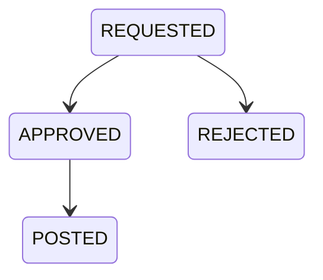

## AdminRequestStatus

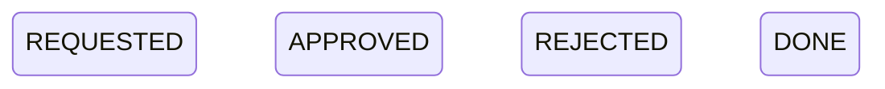

## BusinessDayRequestStatus

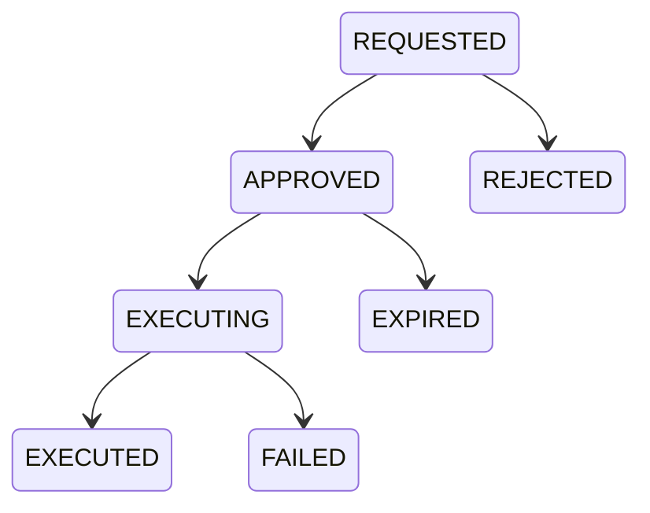

## BusinessDayStatus

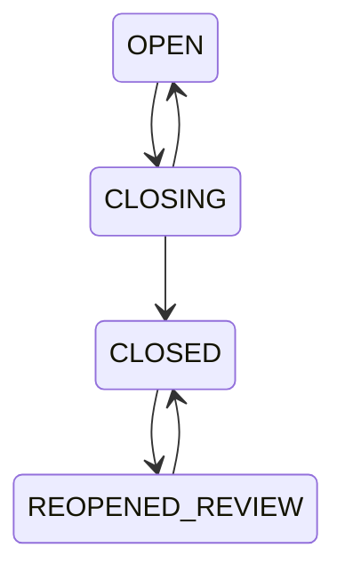

## DepositStatus

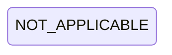

## DisputeStatus

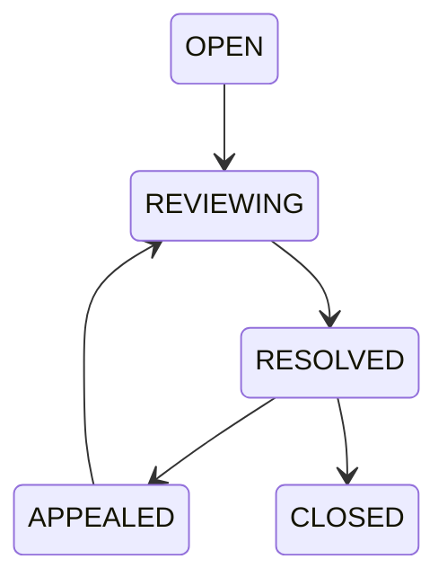

## ExportStatus

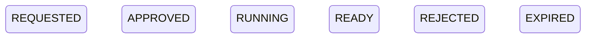

## FileStatus

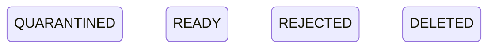

## FulfillmentStatus

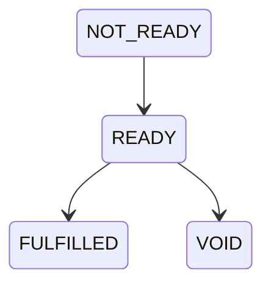

## IdempotencyStatus

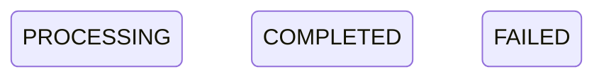

## InboxStatus

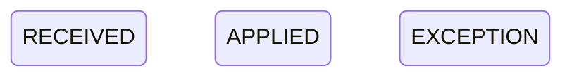

## MerchantApplicationStatus


## MerchantStatus


## OfflineReviewStatus

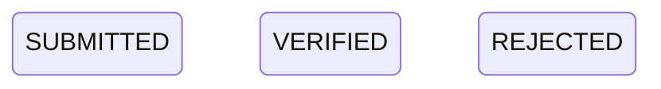

## OrderStatus

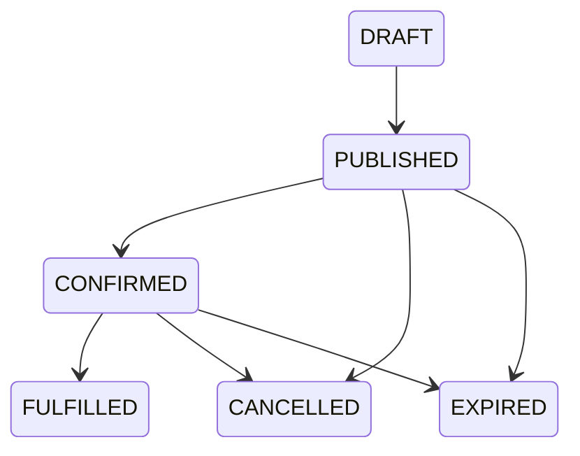

## OutboxStatus

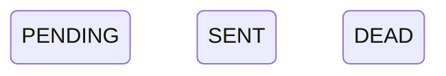

## ReceivableStatus

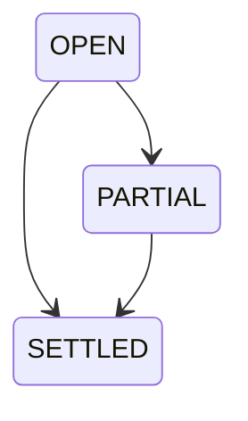

## ReconDifferenceStatus


## ReconciliationStatus

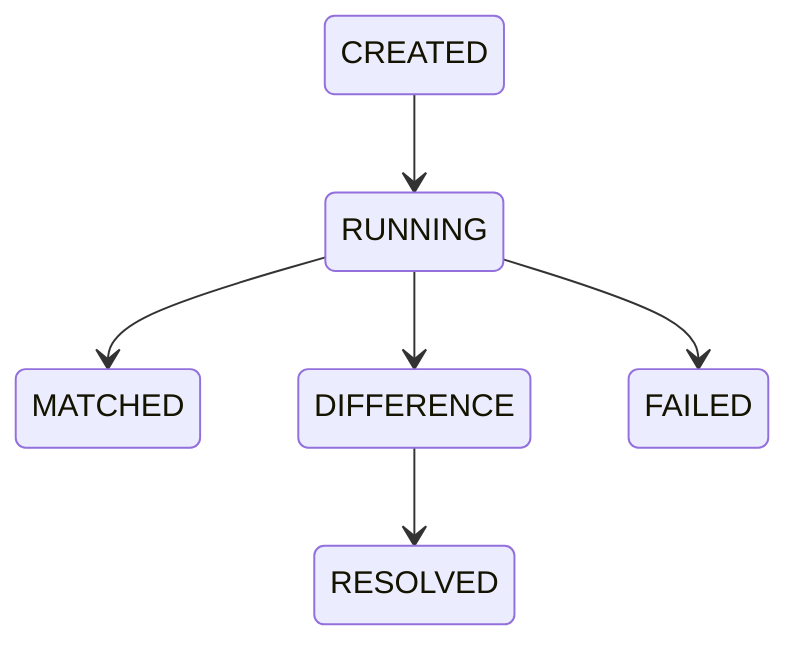

## RefundStatus

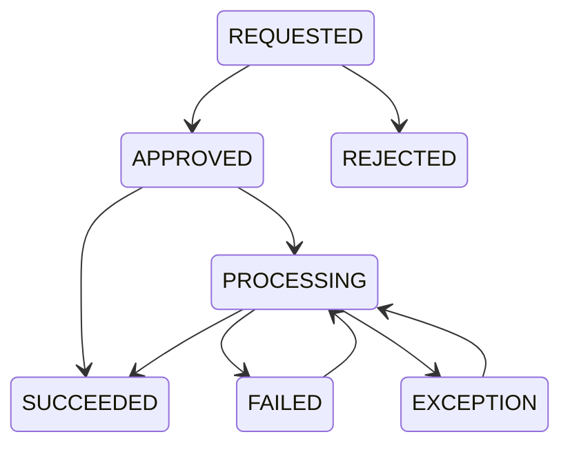

## RepaymentStatus

```mermaid
stateDiagram-v2
    state "CREATED" as CREATED
    state "PENDING" as PENDING
    state "CONFIRMED" as CONFIRMED
    state "FAILED" as FAILED
    state "CLOSED" as CLOSED
    state "EXCEPTION" as EXCEPTION
    CREATED --> PENDING
    PENDING --> CONFIRMED
    PENDING --> FAILED
    PENDING --> CLOSED
    CLOSED --> EXCEPTION
    FAILED --> EXCEPTION
    EXCEPTION --> CONFIRMED
```

## ReservationStatus

```mermaid
stateDiagram-v2
    state "HELD" as HELD
    state "CONSUMED" as CONSUMED
    state "RELEASED" as RELEASED
    state "EXPIRED" as EXPIRED
    HELD --> CONSUMED
    HELD --> RELEASED
    HELD --> EXPIRED
```

## RuleVersionStatus

```mermaid
stateDiagram-v2
    state "DRAFT" as DRAFT
    state "APPROVED" as APPROVED
    state "RETIRED" as RETIRED
```

## SettlementStatus

```mermaid
stateDiagram-v2
    state "NOT_APPLICABLE" as NOT_APPLICABLE
```

## UserStatus

```mermaid
stateDiagram-v2
    state "ACTIVE" as ACTIVE
    state "SUSPENDED" as SUSPENDED
    state "CLOSED" as CLOSED
```
